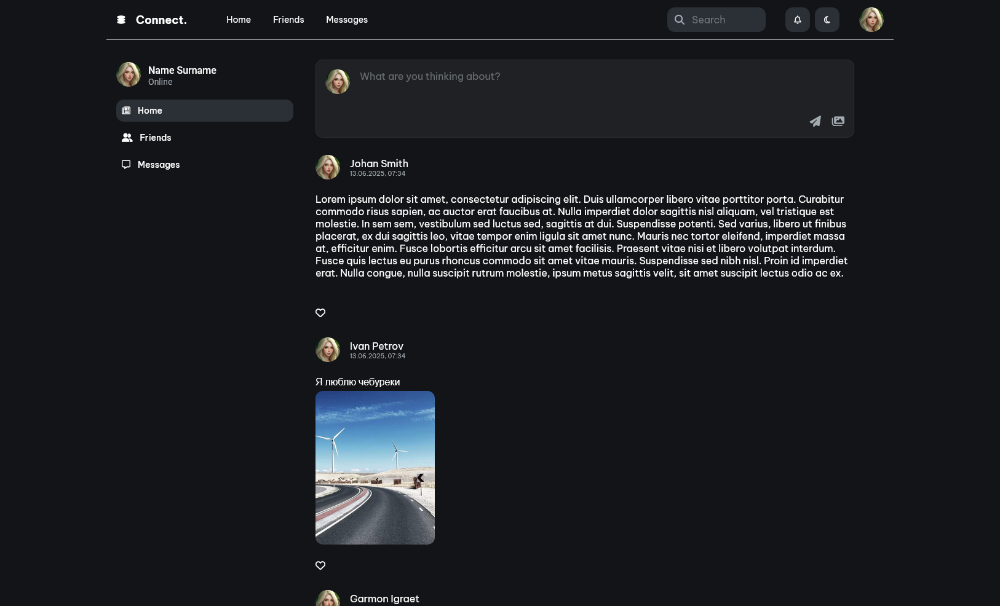

# Connect. — Social App UI

Проект представляет собой интерфейс для социальной платформы с тёмной темой. На текущем этапе реализован базовый макет навигации, header, навигация вторичная, блок добавления постов сверстан:

* Логотип и название проекта
* Навигационные вкладки: Home, Friends, Messages
* Поисковая строка
* Иконки уведомлений, переключатель темы и аватар пользователя

## Скриншот

## Технологии

* **Frontend:** Angular, Font Awesome

## Установка и запуск

> Убедитесь, что у вас установлен Node.js (рекомендуется версия LTS) и пакетный менеджер npm или yarn.

1. **Клонируйте репозиторий:**

   ```bash
   git clone https://github.com/nazvl/connect-project.git
   cd connect-project
   ```

2. **Установите зависимости:**

   ```bash
   npm install
   ```

   или, если используете yarn:

   ```bash
   yarn install
   ```

3. **Запустите проект локально:**

   ```bash
   ng serve
   ```

   После сборки откройте [http://localhost:4200](http://localhost:4200) в браузере.

## TODO

* Реализовать отображение контента (лента, список друзей и сообщений)
* Добавить функциональность к иконкам и поиску
* Интеграция с бекендом (в перспективе)

---

> Проект находится в стадии активной разработки.
