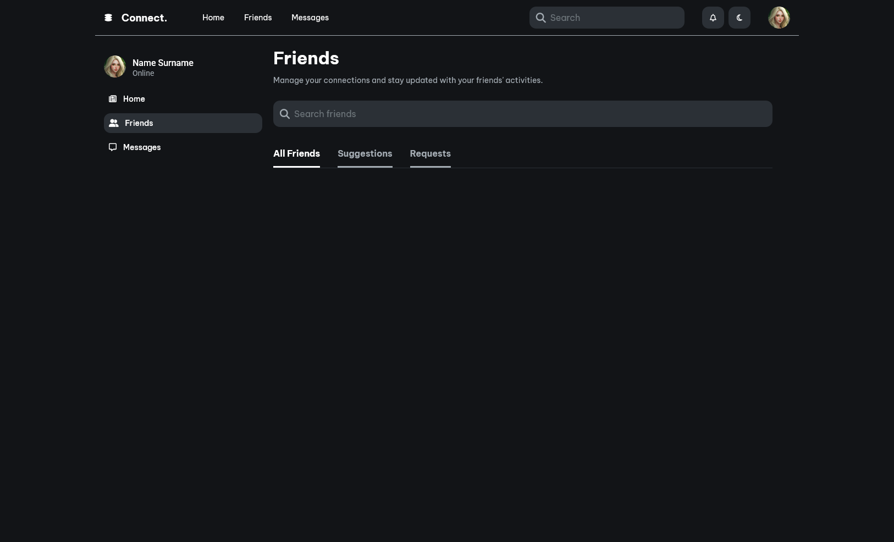

# Connect. — Social App UI

Проект представляет собой интерфейс для социальной платформы с тёмной темой. На текущем этапе реализован базовый макет навигации и шапки:

- Логотип и название проекта
- Навигационные вкладки: Home, Friends, Messages
- Поисковая строка
- Иконки уведомлений, переключатель темы и аватар пользователя

## Скриншот

## Технологии

- **Frontend:** Angular, Font Awesome

## TODO

- Реализовать отображение контента (лента, список друзей и сообщений)
- Добавить функциональность к иконкам и поиску
- Интеграция с бекендом (в перспективе)

---

> Проект находится в стадии активной разработки.
